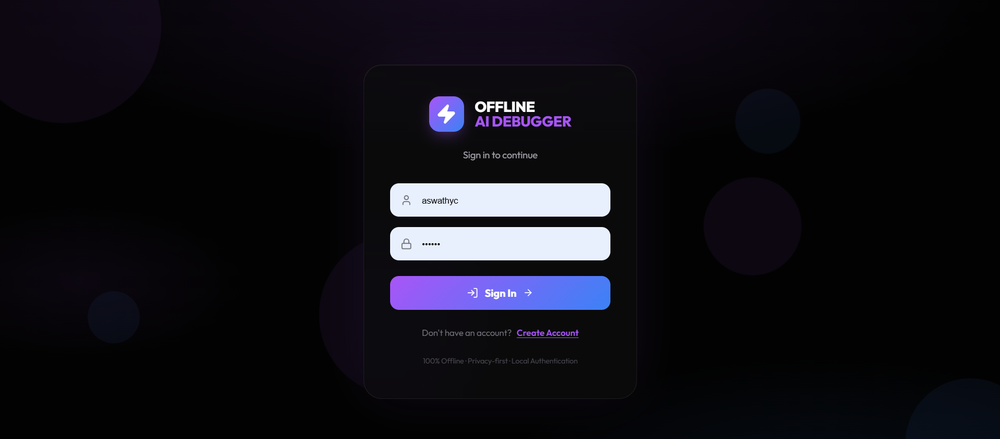
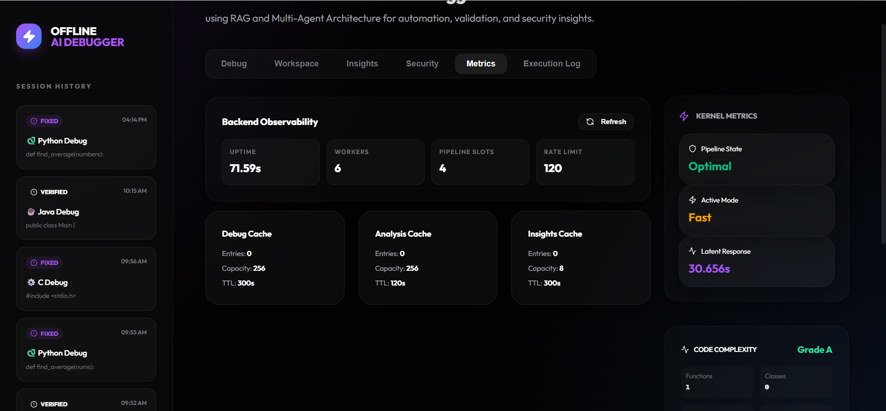

# ⚡ Offline Multi-Language AI-Powered Code Debugger

> **Intelligent debugging using RAG Architecture + Local LLM — no internet required.**

[](https://python.org)
[](https://fastapi.tiangolo.com)
[](https://reactjs.org)
[](https://huggingface.co/Qwen)
[](#architecture)
[](LICENSE)

---

## 🧠 What Is This?

Most AI debugging tools send your code to the cloud. This one doesn't.

This project is a **fully offline, AI-powered debugging platform** that detects bugs, explains their root cause, and auto-generates corrected code — all running locally on your machine. It supports **Python, C, and Java**, and uses a locally deployed **Qwen2.5-Coder LLM** combined with a **Retrieval-Augmented Generation (RAG)** pipeline to deliver context-aware debugging without any internet dependency.

Built as an MCA major project at FISAT, Angamaly (APJ Abdul Kalam Technological University), 2026.

---

## ✨ Key Features

| Feature | Description |
|---|---|
| 🔒 **100% Offline** | Code never leaves your machine — full data privacy |
| 🐛 **Hybrid Error Detection** | Rule-based heuristics + AI reasoning combined |
| 🤖 **Local LLM Integration** | Qwen2.5-Coder (GGUF quantized) via llama-cpp-python |
| 📚 **RAG Pipeline** | Local knowledge base enhances explanation accuracy |
| 🔁 **Multi-Agent Pipeline** | Analyzer → Explainer → Fixer → Critic agents |
| 🛡️ **Security Analysis** | Detects unsafe functions, hardcoded secrets, injection risks |
| 📊 **Complexity Evaluation** | Code quality grading with cyclomatic complexity (radon) |
| 📝 **Structured Reports** | Error type, severity, explanation, and patched code |
| 🌐 **Multi-Language** | Python, C, and Java supported |

---

## 🏗️ Architecture

```
┌─────────────────────────────────────────────────────┐
│                   React Frontend                    │
│     (Paste/Upload Code → View Results & Reports)    │
└────────────────────┬────────────────────────────────┘
                     │ HTTP (FastAPI)
┌────────────────────▼────────────────────────────────┐
│               FastAPI Backend                       │
│   Routes → Pipeline Controller → Report Generator  │
└────┬──────────────┬──────────────────┬──────────────┘
     │              │                  │
┌────▼────┐  ┌──────▼──────┐  ┌───────▼───────┐
│Heuristic│  │  RAG Module │  │  LLM (Local)  │
│ Engine  │  │ (Knowledge  │  │  Qwen2.5-Coder│
│(Rules)  │  │   Base)     │  │  via llama.cpp│
└────┬────┘  └──────┬──────┘  └───────┬───────┘
     └──────────────▼──────────────────┘
              Multi-Agent Pipeline
     ┌──────────┬──────────┬──────────┐
     │ Analyzer │Explainer │  Fixer   │  → Critic (Validator)
     └──────────┴──────────┴──────────┘
                     │
              ┌──────▼──────┐
              │   SQLite    │  (Debug History)
              └─────────────┘
```

### Pipeline Modes
- **FAST** — Heuristics only, prioritizes latency (~30ms)
- **FULL (VIPER)** — Full multi-agent AI pipeline, deep analysis

---

## 🚀 Getting Started

### Prerequisites

- Python 3.10+
- Node.js 18+
- 8 GB RAM minimum (16 GB recommended for LLM)
- 256 GB SSD recommended

### 1. Clone the Repository

```bash
git clone https://github.com/Aswathy7-git/<repo-name>.git
cd <repo-name>
```

### 2. Download the Local LLM Model

```bash
mkdir -p models
# Download Qwen2.5-Coder GGUF (Q4_K_M quantized)
# Place it at: models/qwen2.5-coder-1.5b-instruct-q4_k_m.gguf
```

> Get the model from [Hugging Face – Qwen2.5-Coder](https://huggingface.co/Qwen/Qwen2.5-Coder-1.5B-Instruct-GGUF)

### 3. Backend Setup

```bash
cd backend
pip install -r requirements.txt
uvicorn main:app --reload --port 8000
```

### 4. Frontend Setup

```bash
cd frontend
npm install
npm run dev
```

### 5. Open in Browser

```
http://localhost:5173
```

---

## 🔍 How It Works

1. **Paste or upload** your code (snippet or full project ZIP)
2. **Select language** — Python, C, or Java
3. **Choose pipeline mode** — FAST or FULL
4. The system runs through the **multi-agent pipeline**:
   - Heuristic engine detects syntax and common errors
   - LLM analyzes code context and logical flaws
   - RAG module pulls relevant knowledge to enhance responses
   - Fixer agent generates corrected code
   - Critic agent validates the patch
5. **View the structured report** — bug type, severity, explanation, fixed code, security findings, and complexity grade

---

## 🧩 Module Breakdown

```
backend/
├── agents.py          # Multi-agent pipeline (Analyzer, Explainer, Fixer, Critic)
├── debug_python.py    # Python-specific heuristic analysis
├── debug_c.py         # C-specific heuristic analysis
├── debug_java.py      # Java-specific heuristic analysis (strict mode)
├── rag.py             # RAG knowledge retrieval
├── config.py          # Logger, environment flags
└── main.py            # FastAPI routes

frontend/
├── src/
│   ├── components/    # Debug panel, Workspace, Security, Metrics tabs
│   └── App.jsx        # Main app shell

models/
└── qwen2.5-coder-1.5b-instruct-q4_k_m.gguf   # Local LLM (not committed)
```

---

## 📸 Screenshots

| Login | Debug Panel | Anomaly Detected |
|---|---|---|
|  |  |  |

| Corrected Code | Metrics |
|---|---|
|  |  |

---

## 🧪 Test Results

All 13 test cases passed across unit, integration, and user-level testing:

| Test Case | Status |
|---|---|
| Code input & project upload | ✅ Pass |
| Language detection (Python / C / Java) | ✅ Pass |
| Fast debug pipeline | ✅ Pass |
| Full VIPER pipeline | ✅ Pass |
| Vulnerability detection (`eval()`, hardcoded secrets) | ✅ Pass |
| AI explanation generation | ✅ Pass |
| Patch generation | ✅ Pass |
| Patch validation (syntax + security + complexity) | ✅ Pass |
| Report generation | ✅ Pass |
| Multi-file analysis | ✅ Pass |
| Workspace scan | ✅ Pass |
| Error handling (invalid input) | ✅ Pass |
| Hardcoded credential detection | ✅ Pass |

---

## ⚙️ Configuration

| Environment Variable | Default | Description |
|---|---|---|
| `OFFLINE_DEBUGGER_DISABLE_MODEL` | `false` | Disable LLM (heuristics only mode) |

---

## 🔮 Future Enhancements

- [ ] VS Code extension for real-time inline debugging
- [ ] Support for JavaScript, Rust, Go
- [ ] CI/CD pipeline integration
- [ ] Advanced visualization dashboard (error trends, quality metrics over time)
- [ ] Adaptive learning from past debug sessions
- [ ] Optional hybrid mode (offline + cloud fallback)

---

## 📚 References

- Lewis et al., *Retrieval-Augmented Generation for Knowledge-Intensive NLP Tasks*, NeurIPS 2020
- Alibaba Cloud, *Qwen2.5-Coder*, 2024 — [huggingface.co/Qwen](https://huggingface.co/Qwen)
- Georgi Gerganov, *llama.cpp* — [github.com/ggerganov/llama.cpp](https://github.com/ggerganov/llama.cpp)
- Tiangolo, *FastAPI* — [fastapi.tiangolo.com](https://fastapi.tiangolo.com)
- OWASP Foundation, *Top 10 Security Risks*, 2021

---

## 👩‍💻 Author

**Aswathy C**  
MCA, Federal Institute of Science and Technology (FISAT), Angamaly  
📧 aswathychandrankutty@gmail.com  
🔗 [LinkedIn](https://linkedin.com/in/aswathy-c-290a652a7) · [GitHub](https://github.com/Aswathy7-git)

---

> *Built to keep your code — and your privacy — offline.*
