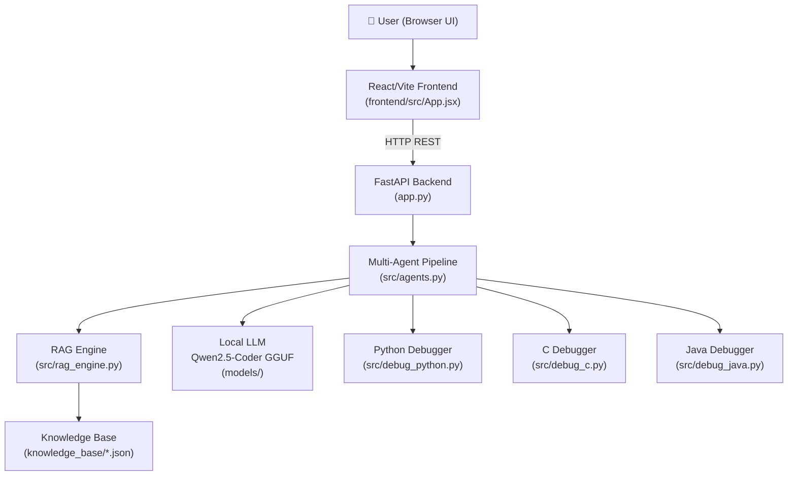
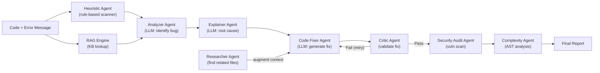

# Offline AI-Powered Code Debugger — Full Project Explanation

## What Is This Project?

This is a **local-first, AI-powered code debugging platform** that runs entirely on your machine — no internet required. You paste or upload buggy code (Python, C, or Java), and the system:

1. Detects what's wrong (using rules, heuristics, and an on-device AI model)
2. Explains the root cause
3. Suggests and generates a fixed version
4. Audits the fix for security and complexity issues

The key innovation is that **the AI model runs locally** (a quantized GGUF model), so your code never leaves your machine.

---

## High-Level Architecture



---

## Project Structure

| Path | Purpose |
|---|---|
| `app.py` | Main FastAPI app — all HTTP endpoints, middleware, pipeline orchestration |
| `run_app.py` | Launcher script — starts backend + frontend dev server together |
| `desktop_app.py` | Optional desktop wrapper using `pywebview` (native window) |
| `src/agents.py` | Core AI logic — all agents live here |
| `src/rag_engine.py` | Retrieval-Augmented Generation — looks up error docs locally |
| `src/debug_python.py` | Heuristic analyzer for Python |
| `src/debug_c.py` | Heuristic analyzer for C |
| `src/debug_java.py` | Heuristic analyzer for Java (strictest rules) |
| `src/scanner.py` | Workspace file scanner and context extractor |
| `backend/config.py` | All environment variables and runtime config |
| `backend/auth.py` | JWT-based authentication |
| `backend/caching.py` | In-memory TTL caches + rate limiter |
| `backend/schemas.py` | Pydantic request/response models |
| `knowledge_base/` | JSON files with error explanations for each language |
| `frontend/src/App.jsx` | Entire React UI (single large component) |
| `frontend/src/LoginPage.jsx` | Login/auth UI |
| `models/` | Where the GGUF AI model is stored |

---

## The Multi-Agent Pipeline (Core Logic)

The system is built around a **multi-agent architecture** where each agent has a specific job:



### Each Agent Explained:

| Agent | What It Does |
|---|---|
| **Heuristic Agent** | Pattern-matches code against known bug patterns per language (before calling the LLM) |
| **Analyzer Agent** | Uses the LLM to identify the bug in ≤15 words |
| **Explainer Agent** | Uses the LLM to explain the root cause in one sentence, augmented by KB docs |
| **Code Fixer Agent** | Uses the LLM to write a corrected version of the code |
| **Critic Agent** | Validates the proposed fix — checks syntax, complexity drift, and critical vulnerabilities |
| **Researcher Agent** | Scans workspace files to find related files (by imports/error keywords) and adds them as context |
| **Security Audit Agent** | Detects vulnerabilities (injection, hardcoded secrets, `eval()`, unsafe C functions, etc.) — also runs Bandit for Python |
| **Complexity Agent** | AST-based cyclomatic complexity analysis + Radon MI score — grades code A–F |
| **Severity Agent** | Classifies the error as CRITICAL / WARNING / INFO |
| **Confidence Agent** | Scores fix confidence 1–10 based on error type, fix length, and placeholder presence |

---

## Language-Specific Debugging Behavior

The project intentionally uses **different strictness levels** per language:

| Language | Strictness | Approach |
|---|---|---|
| **Python** | Normal | Runs code, catches runtime exceptions, AST analysis |
| **C** | Normal | Checks for unsafe functions, memory issues, division by zero |
| **Java** | **STRICT / Zero-Trust** | Assumes bugs exist, validates compilation, checks uninitialized vars, NullPointerException risks |

> The LLM system prompt literally says: *"Apply STRICT debugging only for Java"* — meaning if any minor issue exists in Java, it's marked UNSTABLE immediately.

---

## RAG Engine (Retrieval-Augmented Generation)

Instead of relying on an internet-connected LLM with training data, the system has a **local knowledge base** of JSON files:

| File | Content |
|---|---|
| `kb.json` | Common Python/general errors (NameError, TypeError, etc.) |
| `pylint_knowledge.json` | Pylint-specific warnings and their descriptions |
| `c_knowledge.json` | C-specific errors (buffer overflow, segfault, etc.) |
| `java_knowledge.json` | Java-specific errors (NullPointerException, ClassCastException, etc.) |

When debugging, the RAG engine:
1. Searches the language-specific KB first
2. Falls back to the generic `kb.json`
3. Falls back to `pylint_knowledge.json` for Python

The matched explanation + suggestion is injected into the LLM's prompt as "Knowledge Base" context.

---

## The Local AI Model

- **Model**: `qwen2.5-coder-1.5b-instruct-q4_k_m.gguf` (Qwen 2.5 Coder, 1.5B parameters, 4-bit quantized)
- **Runtime**: `llama-cpp-python` (runs GGUF models locally via CPU)
- **Context window**: 2048 tokens
- **Threads**: Automatically set to `min(cpu_count, 8)`

The model is **optional** — if not downloaded, the system still works using heuristic rules only.

---

## REST API Endpoints (Backend)

| Endpoint | Method | Purpose |
|---|---|---|
| `/health` | GET | Health check |
| `/debug_snippet` | POST | Debug a code snippet |
| `/debug_batch` | POST | Debug multiple snippets at once |
| `/upload_project` | POST | Upload a `.zip` project for debugging |
| `/scan_project` | GET | List workspace files (with filtering/pagination) |
| `/apply_fix` | POST | Write fixed code back to file |
| `/validate_fix` | POST | Pre-commit validation of a proposed fix |
| `/workspace_insights` | GET | Analytics: hotspots, grades, largest files |
| `/metrics` | GET | Runtime metrics (uptime, cache stats, etc.) |
| `/set_workspace` | POST | Change the workspace root directory |
| `/login` | POST | Get JWT auth token |

---

## Frontend (React/Vite UI)

The UI is a single-page React app with these main views:

| Tab/Feature | Description |
|---|---|
| **Debug Panel** | Paste code + error, select language, run Full or Fast pipeline |
| **Scan / Upload** | Upload ZIP project or scan a workspace directory |
| **Insights Tab** | View workspace analytics (code grades, hotspot files) |
| **Validate Patch** | Submit a proposed fix and get a safety report before committing |
| **Login Page** | JWT-based auth to protect the API |

The UI connects to `http://localhost:8000` by default (overridable via `frontend/.env`).

---

## Pipeline Modes

| Mode | What Happens |
|---|---|
| **Fast** | Single-pass: heuristic scan → LLM fix → return result |
| **Full (Viper)** | Multi-pass: researcher → fix → critic (up to 2 retry attempts) → security + complexity audit |

---

## Security Features

- File operations are **sandboxed** to the workspace root (no path traversal)
- Upload files are **extension + size validated**
- Auto-fix writes to `fixed_<filename>.py` — original is never overwritten
- CORS is restricted to explicit localhost origins by default
- In-memory **per-client rate limiting** on heavy endpoints
- Request tracing via `X-Request-ID` headers
- JWT authentication for the API

---

## How to Run

```bash
# 1. Install Python dependencies
pip install -r requirements.txt

# 2. Install frontend dependencies
cd frontend && npm install && cd ..

# 3. (Optional) Download the AI model
python download_model.py

# 4. Launch everything
python run_app.py
```

Then open your browser at `http://localhost:5173` (frontend).

---

## Data Flow: End-to-End Example

1. User pastes buggy Python code with error `ZeroDivisionError` in the UI
2. Frontend POSTs to `/debug_snippet`
3. Backend runs **heuristic scanner** (`debug_python.py`) → detects division by zero
4. **RAG engine** looks up `ZeroDivisionError` in `kb.json` → gets explanation + suggestion
5. **Multi-agent pipeline** runs: Analyzer → Explainer → Code Fixer (LLM or heuristic fallback)
6. **Critic agent** validates the fix (syntax OK? complexity acceptable? no new vulns?)
7. **Security audit** checks for injection, hardcoded secrets, etc.
8. Structured JSON response returned to frontend (status, bug type, explanation, fixed code)
9. User sees the result and can click "Apply Fix" to write it back to disk
